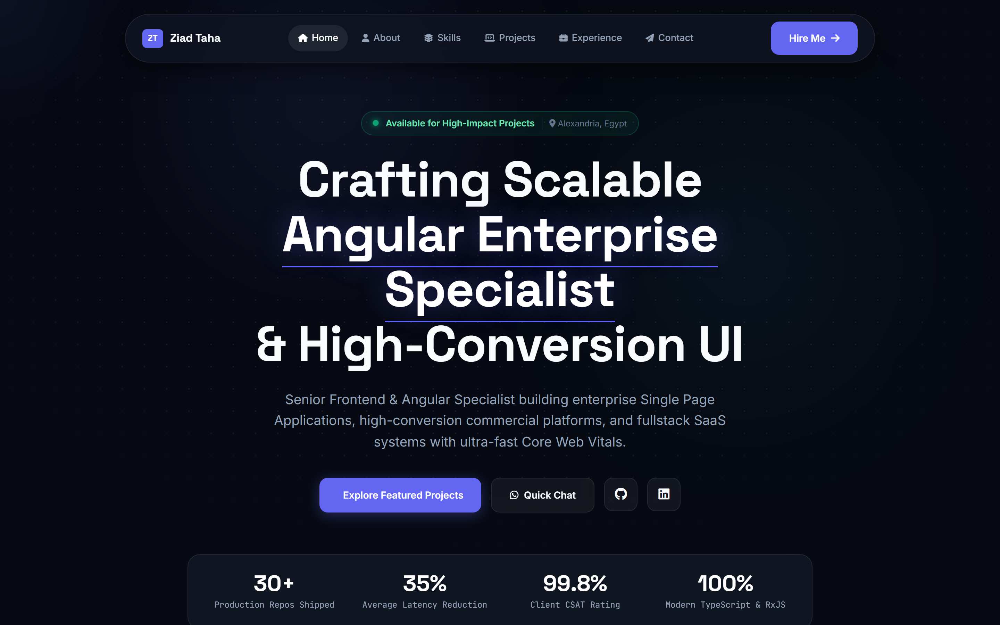

# Ziad Taha — Developer Portfolio


## Visual Preview

<div align="center">
  
</div>


This repository contains the static portfolio site for **Ziad Taha**, a full-stack developer based in Alexandria, Egypt. The site is a direct entry point to a broader GitHub portfolio spanning educational systems, e-commerce, operational dashboards, Node.js/NestJS APIs, React/TypeScript applications, and Three.js experiments.

## Repository contents

| File | Purpose |
|---|---|
| `index.html` | Portfolio document structure and content |
| `app.js` | Client-side interactions |

## Local preview

Open `index.html` using a static web server during development. For example:

```bash
npx serve .
```

## Portfolio standards

Keep external project links current, avoid claiming unverified production metrics, and use compressed, descriptive image assets with meaningful alternative text. If a deployment workflow is added, it should run a basic HTML validation and link check before publishing.

## Highlighted work

The wider portfolio includes FaceMark attendance operations, Edu-Pro education systems, Flowdesk Egypt booking operations, multilingual Arabic e-commerce experiments, and interactive WebGL work. Visit the profile repositories for source-level project evidence.

